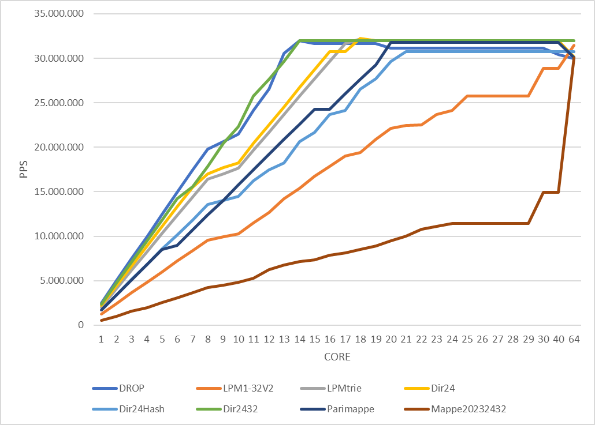

# Implementazione di algoritmi di routing su ebpf

Questi programmi si basano sulle lezioni di [XDP tutorial](https://github.com/xdp-project/xdp-tutorial).

## Programmi:
- [Drop](#drop)
- [DropIP](#dropip)
- [DropPortaTCP](#dropportatcp)
- [DropPortaUDP](#dropportaudp)
- [Dir24](#dir24)
- [Dir24Hash](#dir24hash)
- [Dir2432](#dir2432)
- [LPM1-32](#lpm1-32)
- [LPMtrie](#lpmtrie)
- [Mappe20232432](#mappe20232432)
- [MappePari](#mappepari)


## Drop
Il programma blocca qualsiasi pacchetto ricevuto.
Stampa il numero di pacchetti per secondo **PPS**, e i **Mbit/s** dei pacchetti bloccati.

## DropIp
Il programma controlla l'ip sorgente di ogni pacchetto e se corrisponde all'ip preimpostato, il pacchetto viene bloccato.
L'ip è stato convertito usando **inet_pton**:
```c
char *ip_param="255.255.255.255";
struct sockaddr_in sa_param;
inet_pton(AF_INET, ip_param, &(sa_param.sin_addr));
__u32 ip = sa_param.sin_addr.s_addr;
```

## DropPortaTCP
Il programma controlla se il paccchetto è TCP e cerca all'interno del suo header il numero di porta di destinazione, se corrisponde ad una porta preimpostata viene bloccato.
Ad esempio il programma blocca i pacchetti che vanno verso la porta 80.

```c
nh_type = parse_tcphdr(&nh, data_end, &tcp);
if (nh_type == bpf_ntohs(80))
	action = XDP_DROP;
```

## DropPortaUDP
Il programma controlla se il paccchetto è UDP e cerca all'interno del suo header il numero di porta di destinazione, se corrisponde ad una porta preimpostata viene bloccato.
Ad esempio il programma blocca i pacchetti che vanno verso la porta 443.

## Dir24
Il programma legge gli ip contenuti nella cartella *mappe* e inserisce gli ip del file /24 in un array con 16.777.216 entries e tutti gli altri ip, da /25 a /32 in un LPM_TRIE, poi controlla se sono contenuti nell'array o nella mappa e li blocca.
Per permettere il funzionamento del programma la cartella mappe.zip va estratta.

## Dir24Hash
Il programma funziona come il precedente, Dir24, ma gli ip contenuti nei file da /25 a /32 vengono inseriti in 8 HashMap diverse.
Per permettere il funzionamento del programma la cartella mappe.zip va estratta.
## Dir2432
Il programma funziona come il precedente, Dir24, ma gli ip da /25 a /32 sono espansi in un'unica HashMap.
L'espansione delle rotte viene eseguita tramite la libreria python **ipaddress**.
``` python
#crea una lista di ip espansi a /32 dall'ip e prefisso in input e lo salva in ips rimuovendo /32
ips = [str(ip1).split("/")[0] for ip1 in ipaddress.IPv4Network(ip+"/"+prefix).subnets(new_prefix=32)]
```
Per permettere il funzionamento del programma la cartella mappe.zip va estratta.
## LPM1-32
Il programma crea 32 Hashmap, una per ogni file nella cartella *mappe*, da /1 a /32.
Per ogni pacchetto ricevuto, controlla se l'ip è presente nelle mappe partendo da 32 a scendere, una volta trovato l'ip, il pacchetto viene bloccato e viene incrementato il contatore della mappa in cui è stato trovato.
Il programma stampa una lista di tutte e 32 le mappe con i relativi contatori, PPS e Mbits/s, più una contenente la somma dei vari contatori.
Per permettere il funzionamento del programma la cartella mappe.zip va estratta.

## LPMtrie
Il programma implementa LPM usando una struttura di ebpf, **BPF_MAP_TYPE_LPM_TRIE**, per contenere tutti gli indirizzi ip.  
Caricamento ip nel trie:
``` c
size_t key_size_ipv4;
struct bpf_lpm_trie_key *key_ipv4;
key_size_ipv4 = sizeof(*key_ipv4) + sizeof(__u32);
key_ipv4 = alloca(key_size_ipv4);

//i indica da quale file proviene il prefisso /32 .. /24 ../ 8 ..  key_ipv4->prefixlen = i;
inet_pton(AF_INET, line, key_ipv4->data);
//carica i valori nel trie
assert(bpf_map_update_elem(fd,key_ipv4,&i,BPF_ANY)==0);
```
Lettura ip dal trie:
``` c
//salva l'ip in formato key4 come è salvato nel trie
union key_4 key4;
key4.b32[0] = 32;
key4.b8[4] = ip_src & 0xff;
key4.b8[5] = (ip_src >> 8) & 0xff;
key4.b8[6] = (ip_src >> 16) & 0xff;
key4.b8[7] = (ip_src >> 24) & 0xff;

//controlla se è presente nel trie
value = bpf_map_lookup_elem(&lpm,&key4);
```
Per permettere il funzionamento del programma la cartella mappe.zip va estratta

## Mappe20232432
Gli ip vengono espansi dalle 32 rotte a solo 4: /20, /23, /24, /32 per avere 4 HashMap con numeri simili di ip all'interno e ridurre al minimo gli accessi in mappa.  Esegue LPM sulle 4 mappe da /32 fino a /20.
Per permettere il funzionamento del programma la cartella mappe.zip va estratta

## MappePari
Gli ip vengono espansi dalle rotte dispari a quelle pari /9 --> /10 dimezzando gli accessi in mappa.  Esegue LPM sulle 18 mappe.
Per permettere il funzionamento del programma la cartella mappe.zip va estratta


## Dati
Le macchine usate per inviare e processare i pacchetti sono state fornite da [CloudLab](https://www.cloudlab.us/).
I dati sono stati presi usando macchine con schede di rete a 100Gbit/s e processori a 64 core.
Per la generazione di pacchetti è stato usato [TRex - Cisco ](https://github.com/cisco-system-traffic-generator/trex-core)


